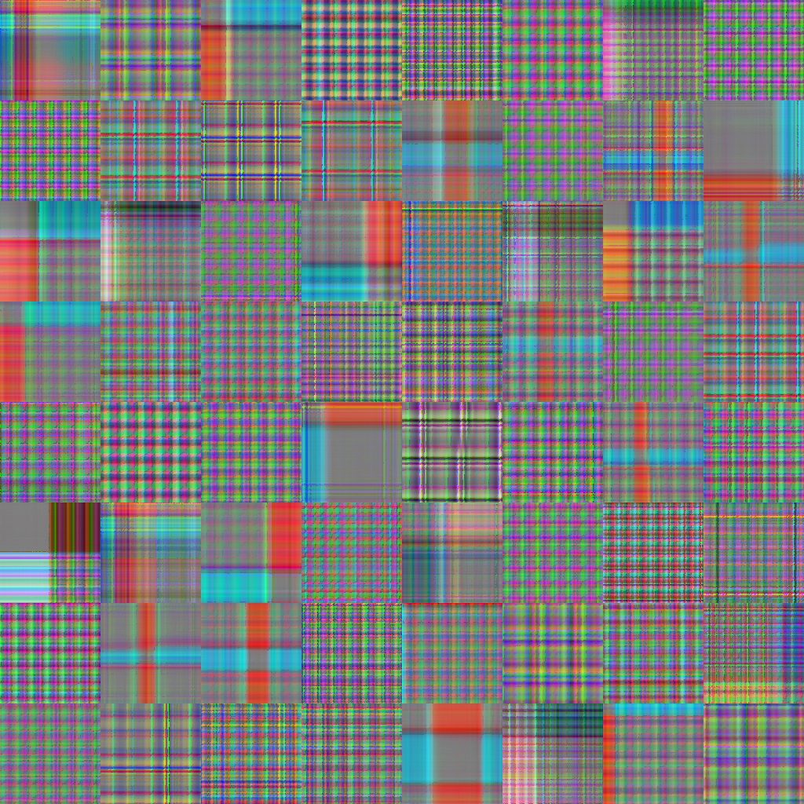
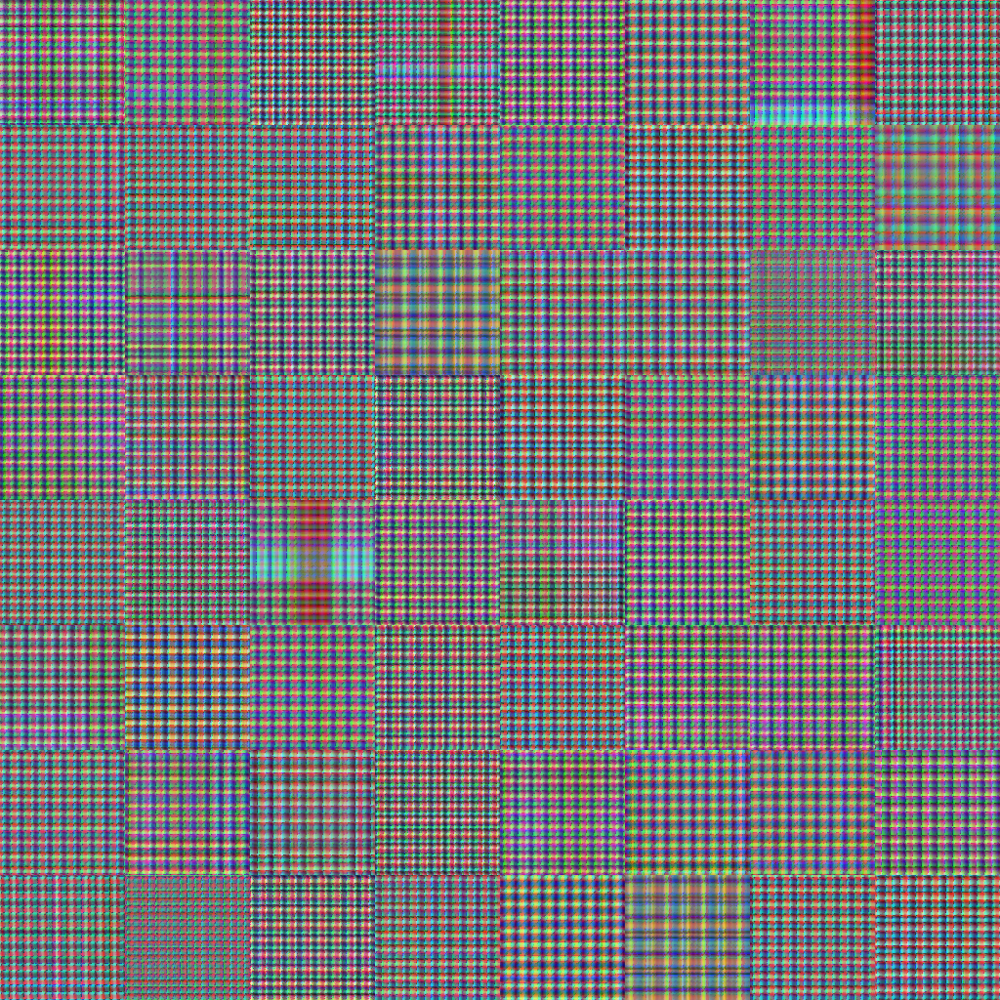
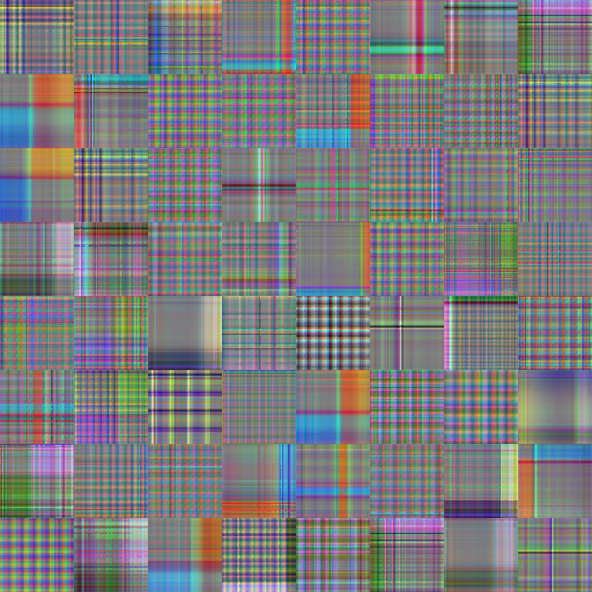
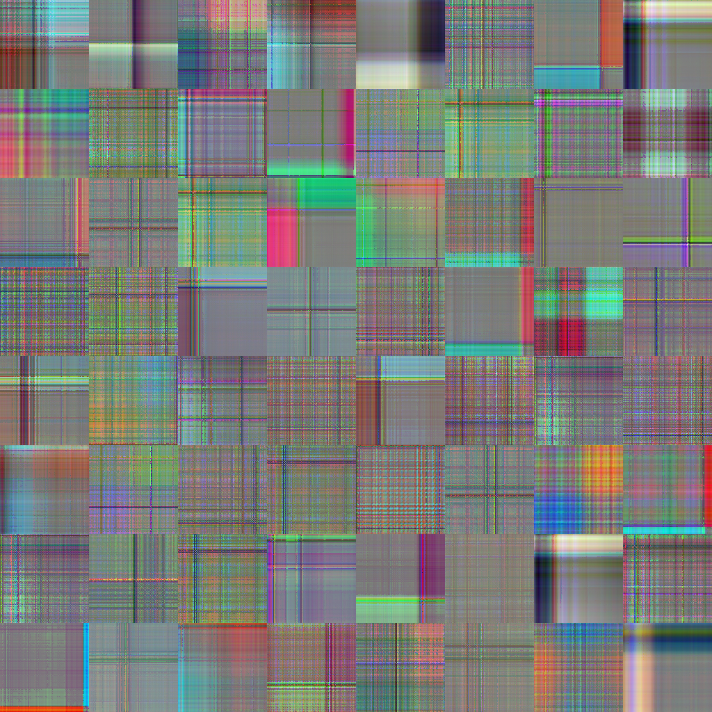
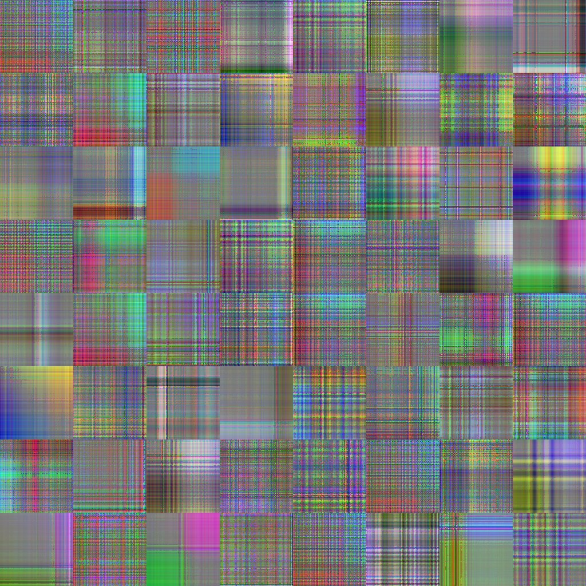

# Official Implementation: Diff-TSD

[](https://github.com/frangam/diff-tsd/stargazers)
[](https://github.com/frangam/diff-tsd/network/members)
[](https://opensource.org/licenses/MIT)  [](https://github.com/frangam/diff-tsd/releases/download/1.0/diff-tsd.zip)

[[`Paper`]Coming Soon] [[`Dataset`](#our-recurrence-plots-dataset)] [[`Citation`](#citation)]


Welcome to the official implementation repository of our paper titled "Diff-TSD: Modelling Time-series Data Generation with Diffusion Models". This repository provides detailed insights, datasets, and other essential resources related to our research and findings.

## Introduction

In our paper "Diff-TSD: Modelling Time-series Data Generation with Diffusion Models", we explore the potential and intricacies of generating time-series data using diffusion models. As an integral part of this work, this repository serves as a comprehensive platform to access the datasets, recurrence plots, and other relevant resources that were instrumental in our research.

## Citation

If you found our work useful, please consider citing:

```bibtex
@article{Garcia-Moreno2023DiffTSD,
    title={Diff-TSD: Modelling Time-series Data Generation with Diffusion Models},
    author={Garcia-Moreno, Francisco M.,and},
    journal={Journal},
    year={2023}
}
```

## Dataset
We used WISDM dataset. The [WISDM dataset](https://ieeexplore.ieee.org/document/8835065/) focuses on data from smartwatch wearables. Our study particularly delves into the dataset which records 51 subjects performing 18 daily activities, such as "walking" and "jogging". We've honed in on five non-hand-oriented activities: "walking", "jogging", "stairs" (both ascending and descending), "sitting", and "standing", amassing a total of 1,053,141 instances. Data collection utilized the smartwatch's accelerometer, recording at a frequency of 20 Hz. For a visual representation of the acceleration waveforms for each activity.

### Activity Distribution of WISDM

| Activity | Instances | Percentage |
|----------|-----------|------------|
| Standing | 216,529   | 20.6%      |
| Sitting  | 213,018   | 20.2%      |
| Walking  | 210,495   | 20.0%      |
| Stairs   | 207,312   | 19.7%      |
| Jogging  | 205,787   | 19.5%      |

As is common in various studies [^1^] utilizing this dataset for classification tasks, we opted to segment the data into full non-overlapping windowed segments (FNOW). Each segment contains 129 data points. The choice of 129, while seemingly unusual, is intentional; one additional data point beyond the typical 128 [^1^] allows us to create recurrence plots of 128x128 pixels.

[^1^]: Abdel-Salam, H., Pham, T., & Elgendi, M. (2021). A Benchmark Dataset and Evaluation of Human Activity Recognition on Smartphones. *Journal of Information*.


## Execution in background 
You can run the scripts with [nohup](https://en.wikipedia.org/wiki/Nohup) which ignores the hangup signal. This means that you can close the terminal without stopping the execution. Also, don’t forget to add & so the script runs in the background:

```sh
$ nohup accelerate launch train.py --config CONFIG_FILE  > your.log &
```

In addition, to close remote terminal safely, you have to run the exit commant, and do not close manually the terminal:

```sh
$ exit
```

Finally, you can identify the running processes of training script with:
```sh
$ ps ax | grep train.py
```

or list of all running processes of Python:
```sh
$ ps -fA | grep python
```

then, kill the desired one:

```sh
$ kill PID
```

## 1. Create Data Splits
In all bash command, we can combine the use "nohup" command to execute a script withouth interuptions (avoiding terminal disconnections, etc.) and "&" symbol at the end of the command for a background execution. We also can use "> filename.log" to put the results in a log file.

**Sampling techniques**
- The Leave-One-Trial-Out (LOTO) approach is a cutting-edge method in sample generation. Each trial encompasses a unique raw activity signal for a single subject, ensuring an impartial evaluation and facilitating the creation of a sufficient number of samples. Additionally, this technique prevents the duplication of trials with identical raw signals (trials of the same label) across both training and testing datasets.
- The Leave-One-Subject-Out (LOSO) approach is a sampling technique inspired by the Leave-One-Trial-Out method. In this approach, all trials belonging to a single subject are considered as an indivisible unit, ensuring that there are no trials from the same subject duplicated in the training and testing datasets. This technique maintains data integrity and prevents potential biases caused by the presence of trials from the same subject in both datasets, allowing for a more robust and reliable evaluation of the model's performance. This technique is the most strict, which proposes a subject-wise approach instead record-wise, and in the literature is not commonly assessed, maybe due to its resulting lower accuracy.


### Our Recurrence plots Dataset

We performed two experiments: One using LOTO to compare our results with previous results and the other using LOSO.

The table below presents the 3-fold data distribution for each sampling approach:

The table below presents the 3-fold data distribution for each sampling approach:

<table>
  <thead>
    <tr>
      <th rowspan="2">3-Folds</th>
      <th colspan="3">FNOW + LOTO</th>
      <th colspan="3">FNOW + LOSO</th>
    </tr>
    <tr>
      <th>Train samples</th>
      <th>Test samples</th>
      <th>Total</th>
      <th>Train samples</th>
      <th>Test samples</th>
      <th>Total</th>
    </tr>
  </thead>
  <tbody>
    <tr>
      <td>Fold-1</td>
      <td>5392</td>
      <td>2672</td>
      <td>8064</td>
      <td>5408</td>
      <td>2688</td>
      <td>8096</td>
    </tr>
    <tr>
      <td>Fold-2</td>
      <td>5392</td>
      <td>2688</td>
      <td>8080</td>
      <td>5344</td>
      <td>2768</td>
      <td>8112</td>
    </tr>
    <tr>
      <td>Fold-3</td>
      <td>5392</td>
      <td>2672</td>
      <td>8064</td>
      <td>5456</td>
      <td>2640</td>
      <td>8096</td>
    </tr>
  </tbody>
</table>


So, from the WISDEM dataset, we extracted [Recurrence plots](https://ieeexplore.ieee.org/document/8691521/) with a legnth of 129 points (128x128 pixels) were generated for each of the five selected classes across every fold. These plots, inspired by the work of Lu and Tong in "Robust Single Accelerometer-Based Activity Recognition Using Modified Recurrence Plot", are available for download on the Hugging Face platform.

Below are links to the data for each sampling and fold combination:

- [Recurrence Plots - LOSO - Fold 1](https://huggingface.co/datasets/frangam/WISDM-mod-recurrence-plot-sampling-loso_fold_1)
- [Recurrence Plots - LOSO - Fold 2](https://huggingface.co/datasets/frangam/WISDM-mod-recurrence-plot-sampling-loso_fold_2)
- [Recurrence Plots - LOSO - Fold 3](https://huggingface.co/datasets/frangam/WISDM-mod-recurrence-plot-sampling-loso_fold_3)
- [Recurrence Plots - LOTO - Fold 1](https://huggingface.co/datasets/frangam/WISDM-mod-recurrence-plot-sampling-loto_fold_1)
- [Recurrence Plots - LOTO - Fold 2](https://huggingface.co/datasets/frangam/WISDM-mod-recurrence-plot-sampling-loto_fold_2)
- [Recurrence Plots - LOTO - Fold 3](https://huggingface.co/datasets/frangam/WISDM-mod-recurrence-plot-sampling-loto_fold_3)

Click the respective links to access and **download** the desired datasets.

Here, an example of the reccurente plots dataset:

<table>
<tr>
    <td>
        <br>
        <center>Class 0 (Walking)</center>
    </td>
    <td>
        <br>
        <center>Class 1 (Jogging)</center>
    </td>
    <td>
        <br>
        <center>Class 2 (Stairs)</center>
    </td>
</tr>
<tr>
    <td>
        <br>
        <center>Class 3 (Sitting)</center>
    </td>
    <td>
        <br>
        <center>Class 4 (Standing)</center>
    </td>
</tr>
</table>


### Create Recurrence Plots
If you want to create recurrence plots:

- "--create-numpies" is for create the first time the numpy arrays.
- With "--sampling loto" you can select the sampling method "loto" or "loso" with "--sampling loso".

For LOTO approach:
```sh
 $ nohup ./generate_recurrence_plots.py --create-numpies --data-name WISDM --n-folds 3 --data-folder YOUR_DATA_PATH --sampling loto > recurrence_plots_loto.log &
```


### Uploading to HuggingFace
Then, we have to upload the recurrence plots to Huggingface platform:

```sh
 $ nohup ./tgen/upload_recurrence_plots_to_huggingface.py --sampling loto --huggingface-token YOUR_TOKEN > upload_rp_loto.log &
```


## 2. Training
First, activate your Python VENV where you have all dependencies installed:

```sh
$ source ~/YOUR_VENV/bin/activate
```

Multi-GPU and multi-node training is supported with [Hugging Face Accelerate](https://huggingface.co/docs/accelerate/index). You can configure Accelerate by running:

```sh
$ accelerate config
```

on all nodes, then running:

For LOTO approach:

```sh
$ nohup accelerate launch ./train.py --config configs/config_wisdm_128x128_loto.json --max-epochs 1000 --batch-size 16 > train_loto.log &
```
For LOSO approach:

```sh
$ nohup accelerate launch ./train.py --config configs/config_wisdm_128x128_loso.json --max-epochs 10000 --batch-size 16 > train_loso.log &
```

on all nodes.

If you want to train only a single class set "--class-names" argument:

```sh
$ nohup accelerate launch ./train.py --config configs/config_wisdm_128x128_loto.json --max-epochs 1000 --batch-size 16 --class-names 4 > train_loto.log &
```


---

All the models that we've trained, including the 15 models for LOTO and 15 for LOSO, are available on [WandB](https://wandb.ai/frangam/diffusion-ts-rp/table?workspace=user-frangam). To find the specific models you're interested in, simply filter by the tags `sampling-loto` or `sampling-loso`.

---

## 3. Sampling

Generate "n" samples (in this case, 2.000).

```sh
$  nohup ./sample.py --config configs/config_wisdm_128x128_loto.json -n 2000  > sample-loto.log &
```

```sh
$  nohup ./sample.py --config configs/config_wisdm_128x128_loso.json -n 2000  > sample-loso.log &
```
By default, this uses the last diffusion model. But, we can use the best model based on the lower value of the FID metric, using "--best-model" argument:

```sh
$  nohup ./sample.py --config configs/config_wisdm_128x128_loto.json -n 2000 --best-model > sample-loto.log &
```

### 4. Prepare to evaluate the shyntetic samples generated
Create splits of images for train/test and assess the quality of synthetic images generated before.

- Synthetic images are the train set.
- TEST set are real data, which are used to validate the model in the training phase Test set are real data, which is used to test the trained model.
- This also  copy the real images used to train the diffusion models to the folder result (you could use this real images to asses the quality of real-based recurrence plots to recognize activities).


```sh
$ nohup ./tgen/data.py --config configs/config_wisdm_128x128_loto.json --prefix exp-classes-all-classes --class-names 0,1,2,3,4 --splits 0,1,2 > data_splits-loto.log &
```

```sh
$ nohup ./tgen/data.py --config configs/config_wisdm_128x128_loso.json --prefix exp-classes-all-classes --class-names 0,1,2,3,4 --splits 0,1,2 > data_splits-loso.log &
```

## 5. Evaluation 
### Evaluation of synthetic recurrence plots sampled
We can evaluate the synthetic sampled images in the recognition of activities. We can use a set of benchmarking [image classifiers](https://github.com/qubvel/classification_models).


Example of evaluation of synthtetic (using LOTO approach and xception model)
```sh
$  nohup ./eval_diffusion.py --model-name xception --prefix exp-classes-all-classes --epochs 100 --synth-train --config configs/config_wisdm_128x128_loto.json > eval-synth-loto-xception.log &
```

### Evaluation of real recurrence plots to compare with synthetic
```sh
$  nohup ./eval_diffusion.py --model-name xception --prefix exp-classes-3-4 --epochs 100 --synth-train  --config configs/config_wisdm_128x128_loto.json > eval-real-loto-xception.log &
```

### FID
Measuring the FID of the synthetic images sampled.

### Install pytorch-fid

Install from [pip](https://pypi.org/project/pytorch-fid/):

```
pip install pytorch-fid
```

### Usage
To compute the FID score between two datasets, where images of each dataset are contained in an individual folder:

```sh
python -m pytorch_fid real_images_folder/ synthetic_images_folder/ --device cuda:0

```

### Using different layers for feature maps

In difference to the official implementation, you can choose to use a different feature layer of the Inception network instead of the default `pool3` layer.
As the lower layer features still have spatial extent, the features are first global average pooled to a vector before estimating mean and covariance.

This might be useful if the datasets you want to compare have less than the otherwise required 2048 images.
Note that this changes the magnitude of the FID score and you can not compare them against scores calculated on another dimensionality.
The resulting scores might also no longer correlate with visual quality.

You can select the dimensionality of features to use with the flag `--dims N`, where N is the dimensionality of features.
The choices are:
- 64:   first max pooling features
- 192:  second max pooling features
- 768:  pre-aux classifier features
- 2048: final average pooling features (this is the default)

```sh
python -m pytorch_fid real_images_folder/ synthetic_images_folder/ --device cuda:0 --dims 64

```

Example with our data (change LOTO or LOSO approach in the paths and folds):

Fold 0:

```sh
python -m pytorch_fid ~/proyectos/TGEN-timeseries-generation/results/fid/loto/real/fold_0/real_train/  ~/proyectos/TGEN-timeseries-generation/results/fid/loto/predicted/fold_0/train/ --device cuda:1 
```

Fold 1:

```sh
python -m pytorch_fid ~/proyectos/TGEN-timeseries-generation/results/fid/loto/real/fold_1/real_train/  ~/proyectos/TGEN-timeseries-generation/results/fid/loto/predicted/fold_1/train/ --device cuda:1 
```

Fold:2

```sh
python -m pytorch_fid ~/proyectos/TGEN-timeseries-generation/results/fid/loto/real/fold_2/real_train/  ~/proyectos/TGEN-timeseries-generation/results/fid/loto/predicted/fold_2/train/ --device cuda:1 
```

---

